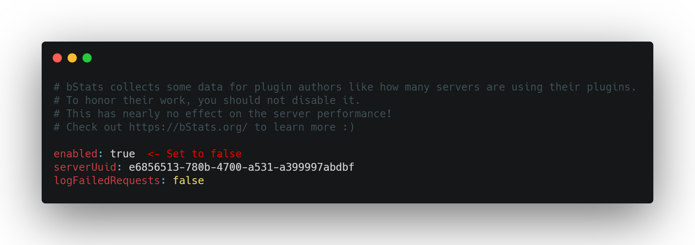

    

__________

- Bla Bla
- Bla Bla
- Bla Bla

__________

- Bla Bla
- Bla Bla
- Bla Bla

__________

This plugin sends statistics to [bStats](https://bstats.org/). This includes the plugin version, operating system, cpu cores, java version, proxy version and current online players.
The collected data is publicly available and can be viewed [here](https://bstats.org/plugin/bungeecord/SuperPenalties/12429).

You can deactivate the statistics in the file `/plugins/bstats/config.yml`.

