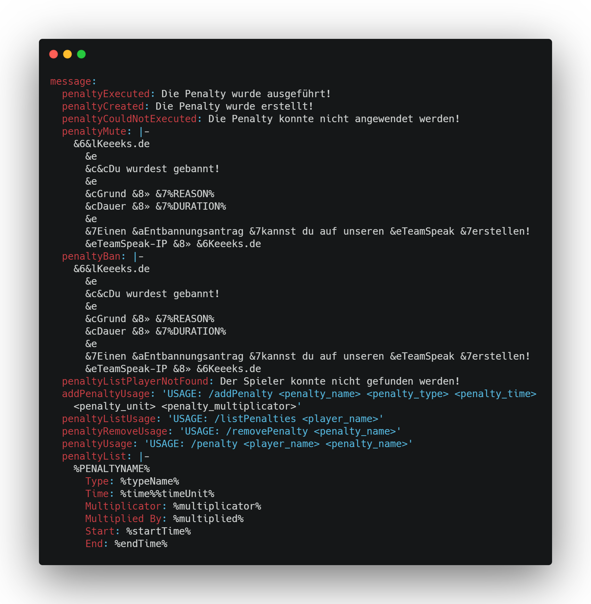

     

__________

- Add predefined Penalties
- Automatic Penalty hardship calculation
- All messages are customizable
- mariaDB connection

**Work in progress:**
- Add custom Penalties
- Redis cache support

__________

- `/addPenalty` Permission: `superpenalty.add` - Register a new Penalty
- `/removePenalty` Permission: `superpenalty.remove` - Removes a Penalty from Database
- `/penalty` Permission: `superpenalty.penalty` - Execute a Penalty
- `/pardon` Permission: `superpenalty.pardon` - Remove a Penalty from a specific Player
- `/listPenalties` Permission: `superpenalty.list` - Shows all executed Penalties from a specific Player

__________

In the file `/plugins/SuperPenalties/config.yml` you can change all messages of the plugin as required. You can also translate it into another language.
The following example is in German:

__________

This plugin sends statistics to [bStats](https://bstats.org/). This includes the plugin version, operating system, cpu cores, java version, proxy version and current online players.
The collected data is publicly available and can be viewed [here](https://bstats.org/plugin/bungeecord/SuperPenalties/12429).

You can deactivate the statistics in the file `/plugins/bstats/config.yml`.

